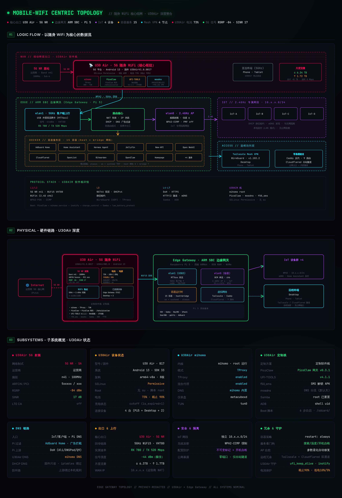

# Mobile-WiFi Edge Gateway

> 5G 随身 WiFi + 树莓派 5 软路由边缘网关方案

折腾这个主要是为了解决随身WiFi只支持单射频的难题，利用上Pi5，实现智能家居自由上网。

---

## 网络拓扑



## 架构概览

```
Internet (5G NR)
  ↓
U30Air 随身WiFi (Android 13 · mihomo TProxy · root)
  ↓ 5GHz WiFi5 VHT80
EdgeGateway · Pi 5 (NAT · DHCP · DNS过滤 · AP)
  ├── wlan0 2.4GHz AP -> IoT 设备群 (10.x.x.0/24 隔离网段)
  ├── Docker 容器层 (AdGuard · HA · Jellyfin · Hermes ...)
  └── Tailscale Mesh + Cloudflared 隧道 (远程访问 · 零公网暴露)
```

## 核心特性

- **单射频破局** -- 随身WiFi单射频无法同时做AP+客户端，Pi5双网卡接管：wlan1连上行、wlan0开AP
- **透明路由** -- U30Air上mihomo以root运行TProxy，全设备无感接入
- **IoT隔离** -- 独立2.4GHz网段，DHCP静态租约，与主网隔离
- **零公网暴露** -- Tailscale + Cloudflared双隧道，不开放任何公网端口
- **ADB远程调试** -- Pi5通过ADB直连U30Air，查日志/改配置/看状态，如果是插卡的话可以收发短信

## 网段规划

| 网段 | 用途 |
|------|------|
| 192.168.0.0/24 | U30Air 上行网 (5GHz WiFi) |
| 10.x.x.0/24 | IoT 隔离网 (Pi5 AP · 2.4GHz) |
| 100.x.x.x | Tailscale Mesh VPN |


## U30Air 软件栈

| 组件 | 说明 |
|------|------|
| mihomo | 透明路由 · TProxy · TUN · root 运行 |
| PicoClaw | AI 网关 · /data/picoclaw |
| UFI-TOOLS | Web 管理面板 · v4.1.1 · 370MB |
| f50_sms | SMS 解锁 APK |
| mosdns | DNS 分流 (默认关) |
| Samba | root · 自定义密码 |
| ADB | shell 用户 (uid=2000) |
| Boot 脚本 | 6 步自启 · /sdcard/ |

SELinux = Permissive，无 su/Magisk，靠 boot 脚本以 root 执行关键服务。

## ADB 远程访问

U30Air 开放 ADB 5555 端口，Pi 5 可直接 shell 进 U30Air 操作。

### 一次性安装

```bash
mkdir -p /tmp/adb-extracted /tmp/adb-deps
cd /tmp/adb-deps && apt-get download adb
dpkg-deb -x adb_*.deb /tmp/adb-extracted
apt-get download android-libbase android-libboringssl android-libcutils \
  android-liblog android-libutils android-libziparchive libprotobuf32t64
for deb in *.deb; do dpkg-deb -x "$deb" /tmp/adb-deps; done

cat > <hermes-install-dir>/bin/adb-remote << 'EOF'
#!/bin/bash
ADB_BIN="/tmp/adb-extracted/usr/lib/android-sdk/platform-tools/adb"
LIB_DIR="/tmp/adb-deps/usr/lib/aarch64-linux-gnu/android"
LIB_DIR2="/tmp/adb-deps/usr/lib/aarch64-linux-gnu"
export LD_LIBRARY_PATH="${LIB_DIR}:${LIB_DIR2}:${LD_LIBRARY_PATH}"
exec "$ADB_BIN" "$@"
EOF
chmod +x <hermes-install-dir>/bin/adb-remote
```

注意: /tmp 重启后清空，需重新执行 step 1。wrapper 脚本在 <hermes-install-dir>/bin/adb-remote 持久保存。

## 部署步骤

1. Pi 5 刷系统，装 Docker + Tailscale + NetworkManager
2. wlan1 连 U30Air（上行），wlan0 开 AP（IoT 网段）
3. U30Air 刷 [minikano/ufi_tools](https://github.com/kanoqwq/UFI-TOOLS) 栈
4. Docker 跑 AdGuard Home + Cloudflared
5. Caddy 绑 tailscale0 做反向代理
6. 验证：IoT 设备能上网、DNS 正常、Tailscale 远程可达

## 作为 Hermes Skill 使用

本仓库同时是一个 [Hermes Agent](https://hermes-agent.nousresearch.com) Skill，其他 Agent 可直接安装：

```bash
# 方式一：直接安装
hermes skills install https://raw.githubusercontent.com/LangeHeris/mobile-wifi-edge-gateway/main/SKILL.md

# 方式二：添加为 skill 源（支持后续更新）
hermes skills tap add LangeHeris/mobile-wifi-edge-gateway
hermes skills install mobile-wifi-edge-gateway
```

安装后，Agent 遇到边缘网关部署、Pi5 网络配置、U30Air 集成等任务时会自动加载此 skill。

## 硬件清单

| 设备 | 规格 |
|------|------|
| Raspberry Pi 5 | 四核 ARM64 · 8GB RAM · NVMe |
| USB WiFi 网卡 | MediaTek MT7612U (5GHz · 802.11ac · VHT80) |
| ZTE U30Air | 5G NR · Band n41 · Android 13 · minikano 定制固件 |

## 文件结构

```
mobile-wifi-edge-gateway/
├── SKILL.md                        # 完整文档入口
├── README.md                       # 本文件
├── assets/
│   └── network-topology.png        # 网络拓扑图
└── references/
    ├── network-architecture.md      # 拓扑、数据流、IP 规划
    ├── pi5-configuration.md         # NM 配置、iptables、sysctl
    ├── u30air-integration.md        # U30Air 软件栈、mihomo、boot 脚本
    ├── dns-chain.md                 # AdGuard + dnsmasq + mihomo DNS
    ├── remote-access.md             # Tailscale + Caddy + Cloudflared
    ├── docker-services.md           # 容器部署、网络模式
    ├── adb-remote-access.md         # ADB 远程调试
    └── pitfalls.md                  # 已知坑、排障指南
```

## 换硬件怎么办

不用 U30Air？任何仅支持单射频的 5G MiFi都行，只要能作为 Pi 5 的上行网关。重点关注：

- `pi5-configuration.md` -- 核心路由配置，通用
- `dns-chain.md` -- DNS 架构，通用
- `remote-access.md` -- 远程访问，通用


## 开始

从 `SKILL.md` 读完整部署流程，按 Phase 1-7 顺序执行。遇到问题查 `references/pitfalls.md`。
